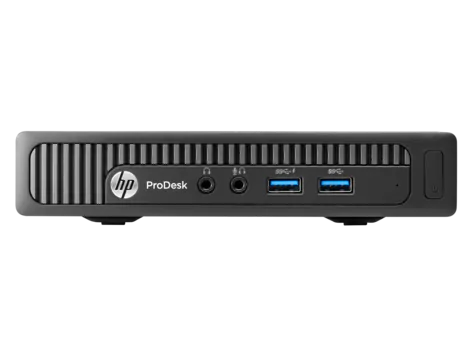
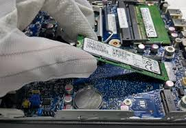

# HP ProDesk 400 G2 DM 
## Ventura 13.1 (22C65)

## Configuration

| Specifications | Details                                          |
| ------------------- | ------------------------------------------- |
| Computer model      | HP Prodesk 400 G2 DM      					|
| Processor           | Intel(R) Core(TM) i5-6500T CPU @ 2.50GHz    |
| SMBIOS              | iMacPro1,1     |
| Graphics			  | Intel HD Graphics 530 fake [Intel Skylake GT2 [HD Graphics 520] 2048  MB]                 		|
| Sound Card          | Realtek ALC221 (layout-id:88)            |
| Ethernet		      | Realtek RTL8111 PCIE                        |
| WiFi		          | Intel 7265 m.2                          	|
| RAM		          | 16GB                                     	|

## Improvements

- This version was prepared using OpenCore 0.8.8.
- Used SSDTTime Script to fix irq issues for sound and generate dsdt-hpet.aml 

## Working / Fixed; 

+ Intel HD 530 blnking screen - fix by inject Intel Iris 520 
+ USB
+ Sound / for internal speaker and lineOut bootargs alcid=88
+ Fixed Airplay screen mirroring - black screen with mouse cursor (Skylake isue) 
+ iMessages
+ Wifi and Ethernet
+ M.2 Pcie SSD 
+ Fixed RTC error on restart 

GeekBench Score 2459
https://browser.geekbench.com/v5/cpu/compare/20112324?baseline=15593232

## Installation

- Durning installation if you nead ethernet and is disconected use terminal to set proper media type. Script is located under /EFI/network_UP_script 

### Issues
+ Wifi Intel 7265 m.2 works witks with Heliport app and AirportItlwm.kext
+ Display Port Audio output isn't working with enabled internal speaker and lineout / remove alcid=88 boot args 
+ Sleep not working. 
+ Display flickering gone. This have something with sound, maybe using Skylake HDMI output was the issue. Adding [layout 88] to boot args enabled internal cheap speaker. Sound quality is excelent on external aplifier. After that no issues with powering down monitor, connection, and some sort of digital movements on display. I was literally prepared to check power in monitor :) but this start to work. Sleep is better.