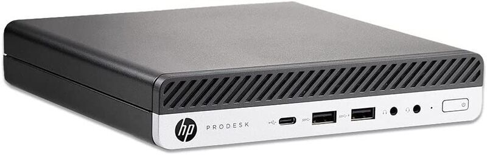

# HP ProDesk 600 G3 DM 
## Ventura 13.2.1 (22D68)

## Configuration

| Specifications | Details                                          |
| ------------------- | ------------------------------------------- |
| Computer model      | HP Prodesk 600 G3 DM      					|
| Processor           | Intel(R) Core(TM) i5-6500T CPU @ 2.50GHz    |
| SMBIOS              | iMac18,1     |
| Graphics			  | Intel HD Graphics 530 fake [Intel HD Graphics 630] 2048  MB]                 		|
| Sound Card          | Conexant	CX20632  layout 20, 23, 28             |
| Ethernet		      | Intel I219-LM                      |
| WiFi		          | Intel 7265 m.2                          	|
| RAM		          | 16GB                                     	|

## Improvements

- This version was prepared using OpenCore 0.8.8.
- Used SSDTTime Script to fix irq issues for sound and generate dsdt-hpet.aml 

## Working / Fixed; 

+ sleep - hibernation fixup
+ Intel HD 530 blnking screen - inject -> Intel HD Graphics 630 
+ USB power
+ Sound / tested only on DP
+ Wifi and Ethernet
+ M.2 Pcie SSD 
+ Fixed RTC error on restart 
+ Wifi Intel 7265 m.2 works as native WiFi
+ Display flickering gone by inserting two of 8GB RAM. One one, there was many problems with acceleration in photoshop and blinkig of power on monitor. 

GeekBench Score 2833
https://browser.geekbench.com/v5/cpu/compare/20897670?baseline=15593232

## Installation

- Durning installation if you nead ethernet and is disconected use terminal to set proper media type. Script is located under /EFI/network_UP_script 

### Issues

+ bluetooth on Intel 7265 m.2 
